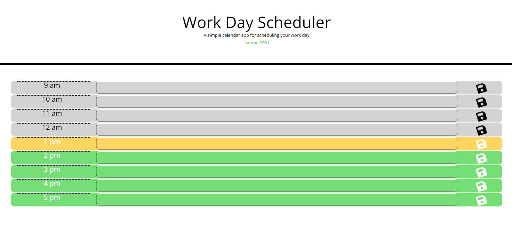

# Work Day Scheduler
## Overview
This project was creating a simple day planner application that allows a user to save events for each hour of the day. This app runs in the browser and features dynamically updated HTML and CSS powered by jQuery.

## Description of Operation
* When you Open the planner
* Then The current day is displayed at the top of the calendar
* When you I scroll down
* Then you are presented with timeblocks for standard business hours
* When you view the timeblocks for that day
* Then each timeblock is color coded to indicate whether it is in the past, present, or future
* When you click into a timeblock
* Then you can enter an event
* When you click the save button for that timeblock
* Then the text for that event is saved in local storage
* When you refresh the page
* Then the saved events persist

## Link to deployed Application

**https://tbr2000.github.io/day-planner/**

## Example Screenshot of Application

